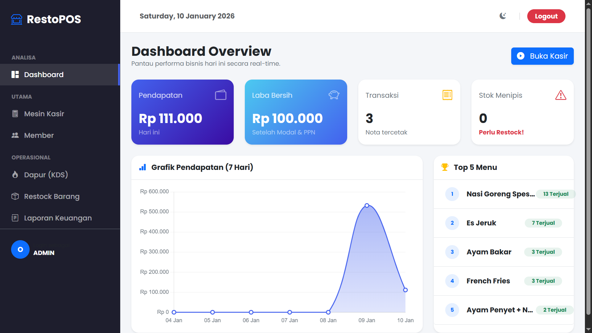
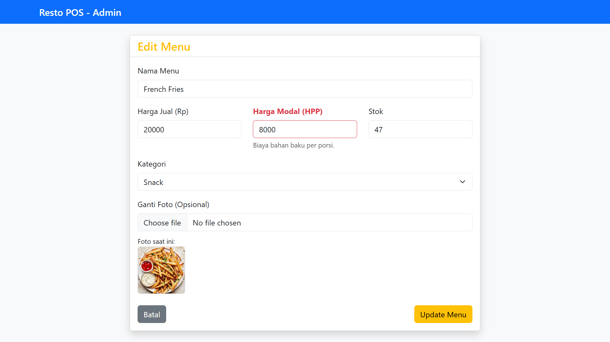
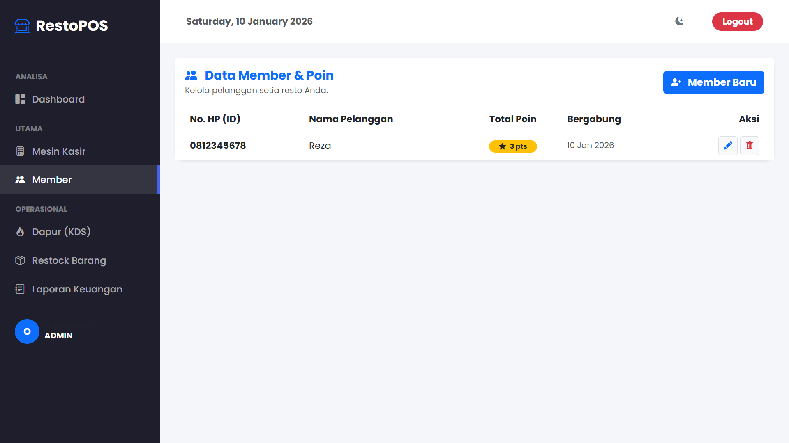
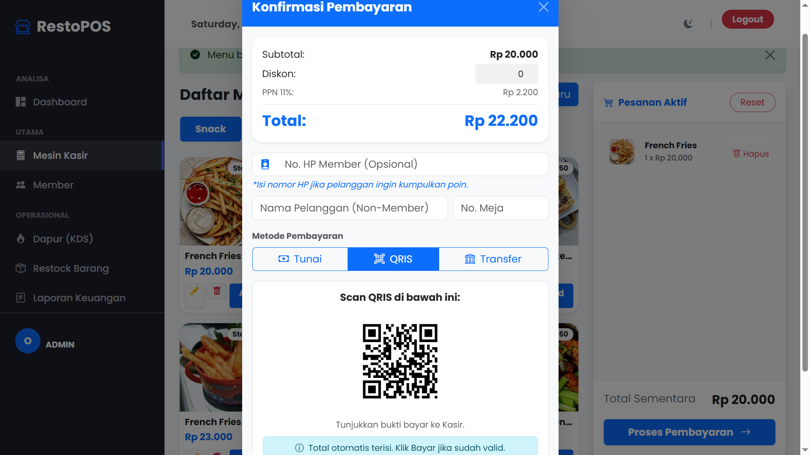
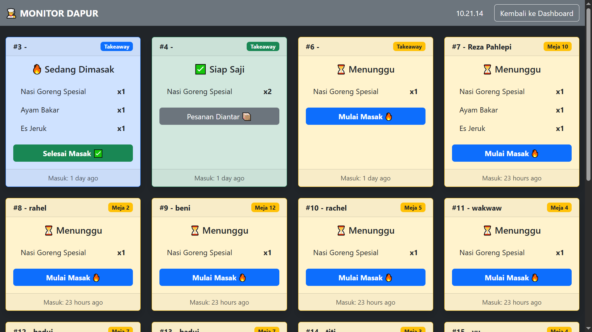
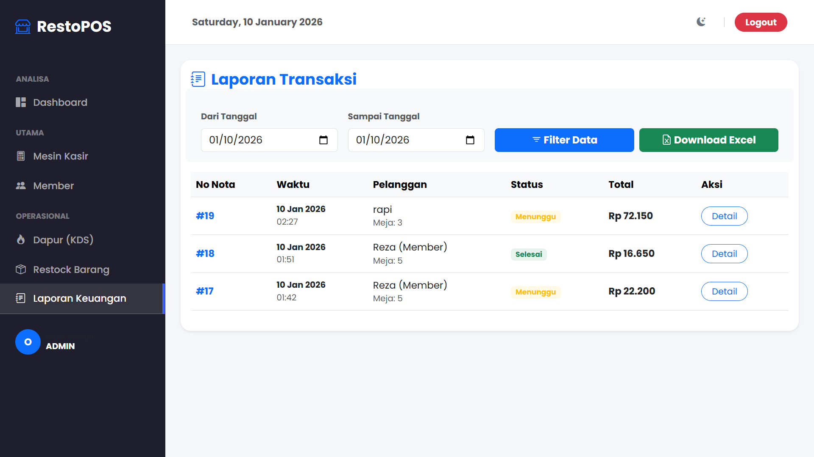
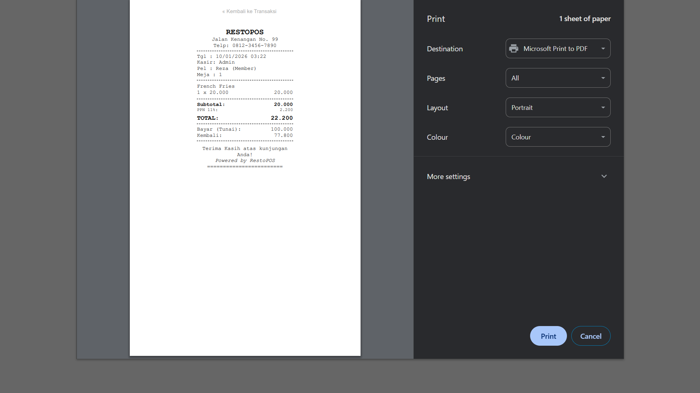
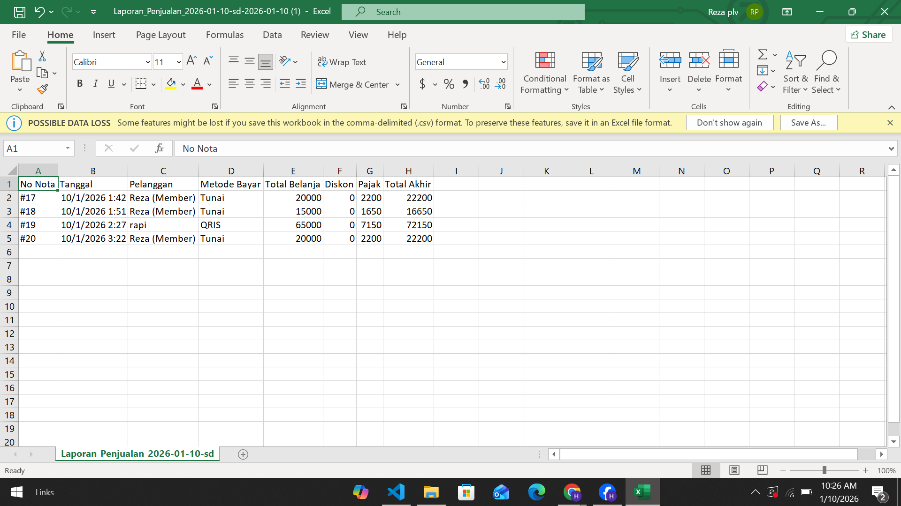
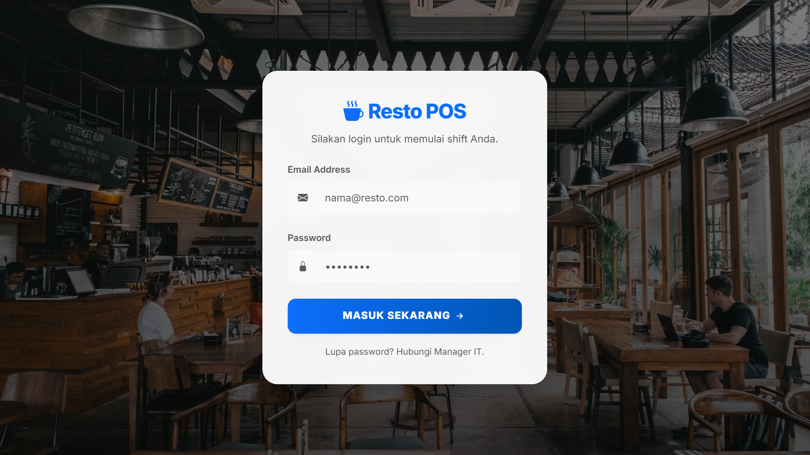

#  RestoPOS - Enterprise Point of Sales System
> **Solusi All-in-One Digitalisasi Operasional Restoran & Manajemen UMKM Modern**

---

##  Visual Showcase (Demo Aplikasi)
Berikut adalah antarmuka sistem RestoPOS yang telah diintegrasikan secara komprehensif.

<table border="0">
  <tr>
    <td width="50%">
      <b>1. Dashboard Analitik & Laba</b> 
      
    </td>
    <td width="50%">
      <b>2. Mesin Kasir Utama (Point of Sale)</b> 
      
    </td>
  </tr>
  <tr>
    <td>
      <b>3. Manajemen Katalog Menu</b> 
      
    </td>
    <td>
      <b>4. CRM & Database Membership</b> 
      
    </td>
  </tr>
  <tr>
    <td>
      <b>5. Gerbang Pembayaran Dinamis</b> 
      
    </td>
    <td>
      <b>6. Monitor Dapur (Kitchen Display)</b> 
      
    </td>
  </tr>
  <tr>
    <td>
      <b>7. Log Riwayat Transaksi</b> 
      
    </td>
    <td>
      <b>8. Preview Struk Thermal (58mm)</b> 
      
    </td>
  </tr>
  <tr>
    <td>
      <b>9. Export Financial Report</b> 
      
    </td>
    <td>
      <b>10. Manajemen Hak Akses User</b> 
      
    </td>
  </tr>
</table>

---

##  Fitur Lengkap Sistem (Full Modules)

###  1. Modul Analisis & Dashboard Business Intelligence
- **Grafik Omzet Interaktif:** Visualisasi tren pendapatan dalam 7 hari terakhir.
- **Top 5 Best Selling Items:** Monitoring otomatis menu yang paling banyak dipesan untuk strategi stok.
- **Counter Dashboard:** Menampilkan total transaksi harian, total member, dan stok menipis secara ringkas.
- **Perhitungan Laba Bersih (Real-time):** Sistem otomatis memotong pendapatan bruto dengan Harga Pokok Penjualan (HPP) untuk mendapatkan profit bersih.

###  2. Modul Kasir Pintar (Smart POS Engine)
- **Sistem Keranjang Dinamis:** Tambah, kurangi, atau hapus item pesanan dengan UI responsif.
- **Kalkulasi Pajak Otomatis:** Perhitungan PPN 11% sesuai regulasi terbaru secara presisi.
- **Engine Diskon:** Input diskon nominal langsung pada transaksi untuk mendukung program promo toko.
- **Input Nomor Meja & Pelanggan:** Identifikasi pesanan berdasarkan lokasi duduk dan identitas pembeli.
- **Kalkulator Tunai Canggih:** Tombol shortcut nominal uang (10k, 20k, 50k, 100k) untuk mempercepat proses kembalian.

###  3. Modul Pembayaran Multi-Channel
- **Tunai (Cash):** Sistem pencatatan uang masuk dan kalkulasi kembalian otomatis.
- **Digital Payment (QRIS):** Menampilkan QR Code statis toko untuk mempermudah transaksi non-tunai.
- **Transfer Bank:** Integrasi info nomor rekening tujuan langsung di layar kasir untuk verifikasi cepat.
- **Validasi Pembayaran:** Tombol konfirmasi final untuk memastikan dana diterima sebelum cetak struk.

###  4. Modul CRM & Loyalitas Pelanggan
- **Database Member Terpusat:** Penyimpanan data nama dan nomor telepon pelanggan yang aman.
- **Point Reward System:** Logika otomatis pengumpulan poin setiap transaksi (misal: 1 poin per Rp 10.000).
- **Auto-Apply Membership:** Deteksi otomatis data member hanya dengan input nomor handphone saat checkout.
- **Monitoring Poin:** Riwayat akumulasi poin yang tercetak langsung pada struk belanja pelanggan.

###  5. Modul Inventaris & Katalog Menu
- **Manajemen Produk CRUD:** Tambah, edit, dan hapus menu dengan kategori (Makanan, Minuman, Snack).
- **Upload Gambar Menu:** Visualisasi menu untuk mempermudah kasir mengidentifikasi produk.
- **Auto-Stock Management:** Stok berkurang otomatis tiap penjualan dan bertambah otomatis saat terjadi pembatalan (Void).
- **Label Status Stok:** Label otomatis "Habis" jika stok mencapai angka 0 agar kasir tidak salah input.

###  6. Modul Kitchen Display System (KDS)
- **Live Order Tracking:** Dapur menerima pesanan secara real-time setelah kasir melakukan konfirmasi bayar.
- **Status Management:** Mengubah status dari "Pending" ke "Selesai" untuk menginformasikan pelayan.
- **Timestamp Order:** Mencatat waktu pesanan masuk untuk memantau durasi pelayanan (Speed of Service).

###  7. Modul Pelaporan & Keamanan
- **Audit Log Transaksi:** Riwayat lengkap seluruh penjualan beserta detail item, metode bayar, dan nama kasir.
- **Export to Excel:** Konversi seluruh data riwayat penjualan ke format spreadsheet untuk pembukuan akuntansi.
- **Role-Based Access Control (RBAC):** - **Admin:** Akses penuh ke laporan keuangan, edit harga, dan manajemen user.
  - **Staff/Kasir:** Akses terbatas hanya pada mesin kasir dan operasional harian.
- **Security Login:** Sistem autentikasi aman untuk mencegah akses tidak sah ke data bisnis.

---

##  Spesifikasi Teknologi
- **Core Framework:** Laravel (PHP) - Menjamin keamanan dan skalabilitas.
- **Database:** MySQL - Penyimpanan data transaksi yang terstruktur dan reliabel.
- **User Interface:** Bootstrap 5 & Custom CSS - Tampilan modern, bersih, dan responsif di berbagai perangkat.
- **Scripting:** Vanilla JavaScript - Logika interaktif pada keranjang dan kalkulator tanpa reload halaman.
- **Architecture:** Model-View-Controller (MVC) - Kode yang rapi dan mudah untuk dikembangkan lebih lanjut.

---

##  Penawaran Lisensi & Kustomisasi
Sistem ini siap digunakan untuk operasional harian. Jika Anda tertarik untuk memiliki **Source Code Lengkap**, melakukan integrasi payment gateway otomatis (Midtrans), atau kustomisasi fitur spesifik lainnya, hubungi melalui:

* **WhatsApp:** [+62 831-3338-7676](https://wa.me/6283133387676)
* **Email:** [hydenruok@gmail.com](hydenruok@gmail.com)

---

  <i>© 2026 RestoPOS Pro Software.</i>

